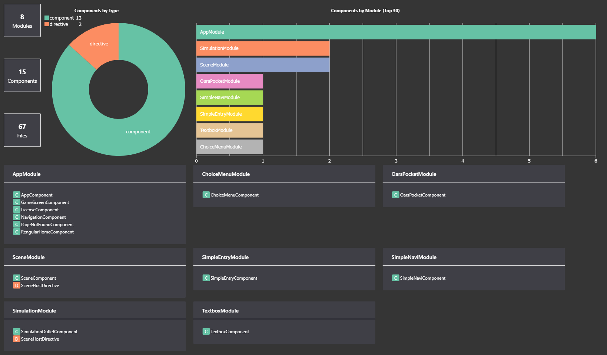
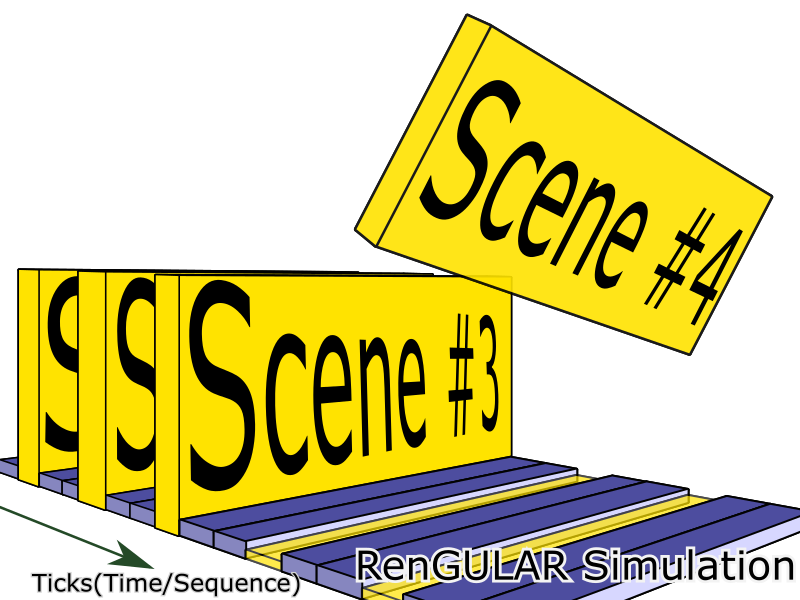

# RenGULAR 

The modern visual novel-style game engine leveraging the power of
[web](https://www.webcomponents.org/) and [Angular](https://angular.io/) in ultimate stories
-- open source and free to render interactive storytelling on browsers acrossing
variety of smart devices upon the modern Web Components standards embracing the
[New Generation of Internet and Web](https://ieeexplore.ieee.org/document/4620089/?arnumber=4620089).

## Design Overview

Coping with Angular (´；ω；｀)ﾌﾞﾜｯ

[](https://angulardoc.org/repos/detail/github/183480328/angular/%252Fsrc/summary)

### RenGULAR Simulation Framework



### Component Theming and Typography

This feature is not required but recommended and currently implemented by default
provided `SimulationService`.

Sample Component:

```javascript
{
  ...
  textbox: {
    // Use Material Dark Theming and Default Typography
    '@theming' : ['mat-dark-theming', 'mat-typography'],
    ...
  },
  ...
}
```

### Scene Program in a Scene (Renaming to Gekijo is in plan)

* Initially, there is one set including one `@program` and one scene(Stage/Gekijo).
* A `GekijoDirective` is with the data structure inherited from the scene itself,
  where the scene data are made modifiable, excepting `@` mark initialled properties.
* `GekijoDirective` would be sent sequentially to the stage from the `@program`.
* If a `GekijoDirective` was sent to Scene(Stage/Gekijo), it would be performed
  immediately.
* The only parameter to arrange the timing for `GekijoDirective` triggering is
  through the sharing property, `delay`, which is default as 0 millisecond and
  optional for an event definition.

* Empty Event
  `{ delay: 0 }`
* Common Event
  `{ delay: 0, textbox: '.....', menu: ['yes', 'no'], ... }`

[Sample Program](https://evangelion.fandom.com/wiki/Episode:06#cite_ref-1):

```javascript
{
  ...
  '@program': [
    { textbox: { text: 'Are you all right? Ayanami! ...' } },
    { textbox: { text: "Don't ever say that ! Just don't say that you have nothing else!" } },
    { delay: 1000, textbox: {
      text: "And don't say goodbye when you leave for a mission, it's just too sad."}},
    { textbox: {
      text: "Why are you crying? I'm very sorry I don't know what I should do or feel at a time like this"}},
    { delay: 2000, textbox: 'Smile is all~' },
  ],
  ...
}
```

## RenGULAR Programming Interface (RenPI)

Initially, RenPI is designed using [Resource Description Framework](https://www.w3.org/TR/rdf11-concepts/) (RDF) with [JSON-LD](https://json-ld.org/) in default.

### DEMO: Simple Quest JSON Repository

There is a [pure json repository](https://github.com/chigix/rengular-api-starter) designed to be used as a starter template or
understanding RenGULAR Programing Interface, deeply representing the core concept
and possible practice on:

* RenGULAR Simulation Framework
* RenGULAR Gekijo Container

### Why JSON-LD

* Simulation Framework design makes the data describing scenes as json linking data.
* JSON-LD makes components data self-describing:
  * Given Objects types
  * Associate properties with IRIs
  * Use [terms](https://w3c.github.io/json-ld-syntax/#dfn-term) defined in a referenced context
  * Property types are specified in context
  * Subject Chaining Definition, Subject Reference, Single Value to Unordered Values,
  terms shorting property names, `@type` coercion, Named Graphs defined in Language
  Feature.
* [Compaction, Expansion, Flattening and Framing](https://w3c.github.io/json-ld-syntax/#forms-of-json-ld)
  designed in json-ld makes RenPI both developer and machine understanding friendly.

## RenGULAR Components v.s ANGULAR Components

Generally, ANGULAR Components, especially the Amazing Material Components set, are
directly able to be installed and used in the whole RenGULAR environment, even
through RenPI operations.

However mostly RenGULAR Components are unable to be directly used onto other
ANGULAR environments due to the dependency of RenGULAR Kernel Services and some
common basic components, RenGULAR Primitive Components.

## RenGULAR Primitive Components (RenCom)

* ChoiceMenu
* LayeredImage
* OarsPocket
* Scene
* Textbox

## RenGULAR Simple Components (RenSimCom)

* SimpleEntry
* SimpleNavi

## RenGULAR Context Actions

* `http://rengular.js.org/schema/StyleAction`: Component Level Styling

  provided for directly applying CSS styles onto target component element.
  However this styling feature is exactly restricted to very few components
  which are created and managed by RenGULAR only.

* `http://rengular.js.org/schema/ComponentAction`: Load New Component
* `http://rengular.js.org/schema/StaticSessionAction`: Store Information shared
  by same type.

## TODO

* Schematics for generate a RenGULAR game boilerplate.

## Development server

Run `npm start` for a dev server. Navigate to `http://localhost:4200/`.
Angular will automatically reload if you change any of the source files.

## Build

Run `npm run build` to build the project.
The build artifacts will be stored in the `dist/` directory.

## Running unit tests

Run `npm run test` to execute the unit tests via [Karma](https://karma-runner.github.io).

## Running end-to-end tests

Run `npm run e2e` to execute the end-to-end tests via [Protractor](http://www.protractortest.org/).

## Story

Inspired by [Ren'Py](https://www.renpy.org/).

## License

[MIT](https://rengular.js.org/license).
