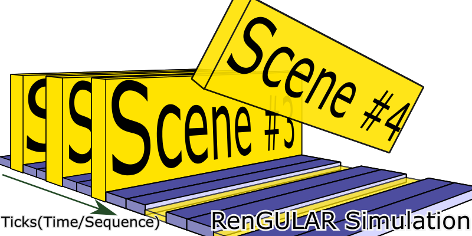

# RenGULAR 

The modern visual novel-style game engine leveraging the power of
[web](https://www.webcomponents.org/) and [Angular](https://angular.io/) in ultimate stories
-- open source and free to render interactive storytelling on browsers acrossing
variety of smart devices upon the modern Web Components standards embracing the
[New Generation of Internet and Web](https://ieeexplore.ieee.org/document/4620089/?arnumber=4620089).

## Design Overview

### RenGULAR Simulation Framework



### Component Theming and Typography

This feature is not required but recommended and currently implemented by default
provided `SimulationService`.

Sample Component:

```javascript
{
  ...
  textbox: {
    // Use Material Dark Theming and Default Typography
    '@theming' : ['mat-dark-theming', 'mat-typography'],
    ...
  },
  ...
}
```

### Scene Program in a Scene(Renaming to Gekijo is in plan)

* Initially, there is one set including one `@program` and one scene(Stage/Gekijo).
* A `GekijoDirective` is with the data structure inherited from the scene itself,
  where the scene data are made modifiable, excepting `@` mark initialled properties.
* `GekijoDirective` would be sent sequentially to the stage from the `@program`.
* If a `GekijoDirective` was sent to Scene(Stage/Gekijo), it would be performed
  immediately.
* The only parameter to arrange the timing for `GekijoDirective` triggering is
  through the sharing property, `delay`, which is default as 0 millisecond and
  optional for an event definition.

* Empty Event
  `{ delay: 0 }`
* Common Event
  `{ delay: 0, textbox: '.....', menu: ['yes', 'no'], ... }`

[Sample Program](https://evangelion.fandom.com/wiki/Episode:06#cite_ref-1):

```javascript
{
  ...
  '@program': [
    { textbox: { text: 'Are you all right? Ayanami! ...' } },
    { textbox: { text: "Don't ever say that ! Just don't say that you have nothing else!" } },
    { delay: 1000, textbox: {
      text: "And don't say goodbye when you leave for a mission, it's just too sad."}},
    { textbox: {
      text: "Why are you crying? I'm very sorry I don't know what I should do or feel at a time like this"}},
    { delay: 2000, textbox: 'Smile is all~' },
  ],
  ...
}
```

## TODO

* Schematics for generate a RenGULAR game boilerplate.

## Development server

Run `ng serve` for a dev server. Navigate to `http://localhost:4200/`. The app will automatically reload if you change any of the source files.

## Code scaffolding

Run `ng generate component component-name` to generate a new component. You can also use `ng generate directive|pipe|service|class|guard|interface|enum|module`.

## Build

Run `ng build` to build the project. The build artifacts will be stored in the `dist/` directory. Use the `--prod` flag for a production build.

## Running unit tests

Run `ng test` to execute the unit tests via [Karma](https://karma-runner.github.io).

## Running end-to-end tests

Run `ng e2e` to execute the end-to-end tests via [Protractor](http://www.protractortest.org/).

## Further help

To get more help on the Angular CLI use `ng help` or go check out the [Angular CLI README](https://github.com/angular/angular-cli/blob/master/README.md).

## Story

Inspired by [Ren'Py](https://www.renpy.org/).

## License

MIT.
